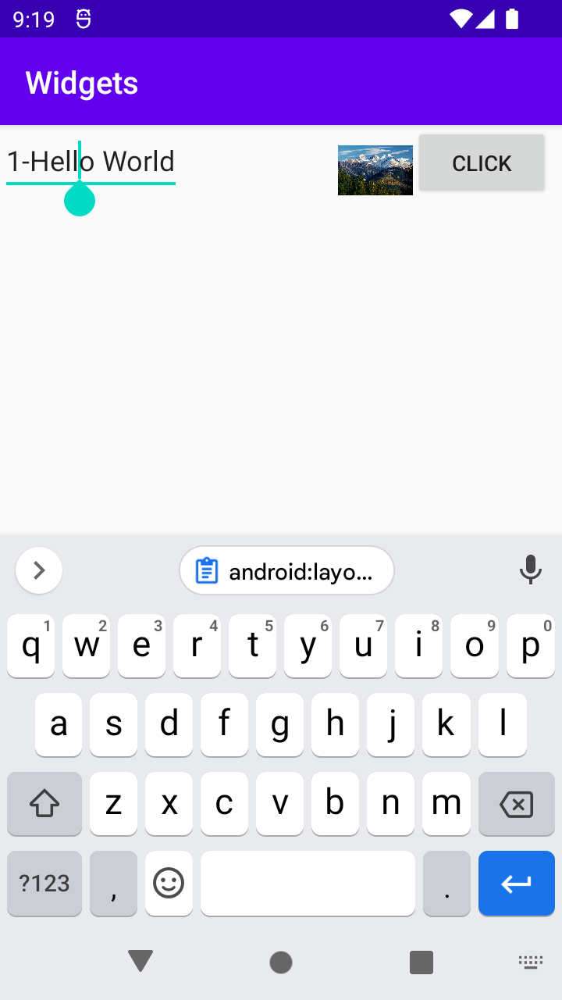

Först ändras main layout till LinearLayout och sen la till
EditText, imageview och button. Sedan används margin attribut 
och ändrade i deras position.

<ImageView
android:id="@+id/imageview"
android:layout_width="48dp"
android:layout_height="48dp"
android:layout_marginVertical="5dp"
android:layout_marginLeft="70dp"
android:src="@drawable/a" />

